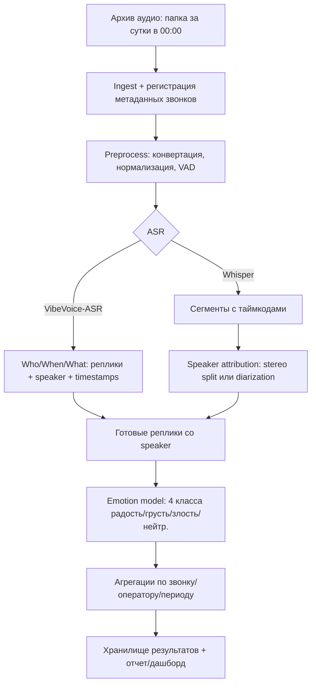

# ML System Design Doc — Система автоматической транскрибации, диаризации и анализа эмоциональной окраски звонков колл-центра (MVP) v1

## Паспорт документа

- Статус: рабочая версия для согласования пилота (MVP)
- Версия: `v1.0`
- Тип документа: `ML System Design Doc`
- Область применения: пилотный контур контроля качества звонков колл-центра
- Основа: шаблон ML System Design Doc (Reliable ML) + проектный черновик `draft.md`

## Назначение документа

Документ фиксирует цели, ограничения, методологию, критерии успешности пилота и требования к MVP-системе автоматической обработки звонков колл-центра:

- автоматическая расшифровка (ASR),
- диаризация/атрибуция говорящих,
- определение эмоциональной окраски реплик,
- формирование аналитики и очереди приоритизации звонков для QA/супервизоров.

Документ предназначен для совместной работы `Product Owner`, `Data Scientist / ML Engineer`, `QA`, `DE` и технических команд, участвующих в подготовке пилота.

---

## 1. Цели и предпосылки

### 1.1. Зачем идем в разработку продукта?

**Бизнес-цель (PO):**

- Сократить стоимость и время ручного контроля качества (QA) звонков и повысить покрытие контроля (ближе к 100% звонков вместо выборочной проверки).
    
- Быстрее находить проблемные разговоры (негатив/конфликт) для работы супервизоров и обучения операторов.
    
- Получать регулярную аналитику по эмоциональному фону диалогов (клиент/оператор) для оценки клиентского опыта.
    

**Почему ML улучшит текущий процесс (PO+DS):**

- Ручная разметка/прослушивание плохо масштабируются, а записи пополняются ежедневно.
    
- Автоматическая расшифровка + эмоции по репликам позволяют:
    
    - строить “таймлайн” диалога,
        
    - быстро фильтровать звонки по негативу/эскалациям,
        
    - агрегировать показатели по операторам/командам/темам.
        

**Успех итерации (бизнес) (PO):**

- Система ежедневно обрабатывает звонки предыдущих суток и выдает результаты в понятном для QA/супервизоров формате.
    
- Супервизоры подтверждают полезность (экономия времени, повышение качества разбора кейсов).
    
- Достигнуты целевые технические метрики (см. ниже) и понятная связь с бизнес-эффектом (скорость QA, выявление проблемных звонков).
    

---

### 1.2. Бизнес-требования и ограничения

**Бизнес-требования (PO):**

- Вход: архив аудиозаписей колл-центра, пополнение каждый день в **00:00** (папки со звонками за предыдущие сутки).
    
- Выход по каждому звонку:
    
    - расшифровка с разбиением на реплики и таймкодами,
        
    - эмоциональная метка для каждой реплики,
        
    - агрегаты по звонку (доля негативных реплик, пиковые участки, “критические моменты”).
        
- Выход по группе (оператор/команда/период): агрегированная статистика эмоций и топ проблемных звонков.
    

**Ограничения (PO):**

- Персональные данные/конфиденциальность: записи разговоров могут содержать ПДн → требуется контроль доступа, шифрование, политика хранения и (возможно) маскирование чувствительных сущностей.
    
- Вычислительные ресурсы: ASR на аудио — самая дорогая часть, нужен расчет/лимиты на пилоте.
    
- Язык: предполагается русский (возможны вставки/код-свитч — уточнить).
    

**Ожидания от итерации (PO):**

- MVP “ночной батч”: обработка за сутки после появления папки (например, до 06:00 результаты готовы).
    
- Минимальная интеграция: выгрузка результатов в таблицу/витрину + простой отчет/дашборд.
    

**Как модель используется в бизнес-процессе пилота (PO):**

- Супервизор/QA получает список звонков с высоким “негативным индексом” и открывает карточку звонка:
    
    - таймлайн реплик (кто/когда/что сказал),
        
    - метки эмоций и уверенности,
        
    - быстрые переходы к “пиковым” моментам.
        
- Далее супервизор принимает действия (обратная связь оператору, обучение, эскалация кейса).
    

**Успешный пилот (PO):**

- Подтвержденный бизнес-эффект: снижение времени QA на 1 звонок и/или увеличение числа разобранных звонков на супервизора.
    
- Достаточная точность эмоций на реальных звонках (валидация на ручной разметке).
    

---

### 1.3. Что входит в скоуп итерации, что не входит

**Входит (DS):**

- Ночной pipeline:
    
    1. ingest новых аудио,
        
    2. ASR с таймкодами и разбиением,
        
    3. определение “кто говорит” (speaker) _в MVP — через VibeVoice-ASR либо упрощение_,
        
    4. эмоция для каждой реплики (4 класса),
        
    5. агрегации и выгрузка результатов.
        
- Модель эмоций: классификация реплик в 4 эмоции из датасета Dusha: **радость/positive, грусть, злость, нейтральная** ([developers.sber.ru](https://developers.sber.ru/portal/products/dusha?utm_source=chatgpt.com "Датасет для распознавания эмоций — Dusha")).
    
- Техническая воспроизводимость: контейнеризация, версионирование моделей и датасетов, фиксированные сплиты.
    

**Не входит (DS):**

- Предсказание исхода звонка, NPS, “оценка оператора” как единый скор (можно позже поверх эмоций/контента).
    
- Тематическое моделирование/ключевые причины обращений.
    
- Real-time обработка (стриминг) — позже.
    
- Полноценная PII-редакция (если потребуется, заложим как отдельный этап/итерацию).
    

**Технический долг (DS):**

- Доработка diarization (если качество недостаточно).
    
- Авто-сбор разметки на реальных звонках (active learning) — после пилота.
    
- Модель эмоций multimodal (аудио+текст) — опционально.
    

---

### 1.4. Предпосылки решения

- Данные пополняются **раз в сутки в 00:00**, значит целевой режим первой итерации — **batch-процессинг “за вчера”**.
    
- Для ASR рассматриваем:
    
    - **Whisper** (семантически сегментирует на интервалы с таймкодами; формат JSON/segments широко поддержан в экосистеме) ([developers.openai.com](https://developers.openai.com/api/docs/guides/speech-to-text?utm_source=chatgpt.com "Speech to text - OpenAI API"))
        
    - **VibeVoice-ASR (Microsoft)** — важное преимущество: объединяет ASR + diarization + timestamps в одной генерации (“Who/When/What”), рассчитан на long-form до ~60 минут ([huggingface.co](https://huggingface.co/microsoft/VibeVoice-ASR?utm_source=chatgpt.com "microsoft/VibeVoice-ASR · Hugging Face"))
        
- Эмоции: стартуем с 4-классовой схемы Dusha ([developers.sber.ru](https://developers.sber.ru/portal/products/dusha?utm_source=chatgpt.com "Датасет для распознавания эмоций — Dusha")), далее при необходимости расширяем (интенсивность/больше классов/доменные эмоции).
    

---

## 2. Методология (DS)

### 2.1. Постановка задачи

Система решает композицию задач:

1. **Speech-to-Text**: перевод аудиозаписи звонка в структурированный текст с таймкодами и разделением на реплики.
    
2. **Speaker attribution**: определение, кто говорит (оператор/клиент или Speaker0/Speaker1).
    
3. **Emotion classification**: многоклассовая классификация эмоции для каждой реплики (4 класса).
    
4. **Aggregation**: расчет признаков/метрик на уровне звонка и групп.
    

---

### 2.2. Блок-схема решения (baseline vs MVP)

Ниже — вариант для MVP (в baseline шаг “эмоции” можно заменить на готовую модель с Hugging Face/простую текстовую тональность).

Опора на возможности VibeVoice-ASR (структурная расшифровка с говорящими и таймкодами) снижает сложность отдельного diarization-шага ([huggingface.co](https://huggingface.co/microsoft/VibeVoice-ASR?utm_source=chatgpt.com "microsoft/VibeVoice-ASR · Hugging Face")).

---

### 2.3. Этапы решения задачи

#### Этап 1 — Подготовка данных

|Название данных|Есть ли данные в компании (источник/витрина)|Требуемый ресурс|Проверено ли качество данных|
|---|---|---|---|
|Архив аудиозаписей звонков|Да (файловое хранилище, ежедневные папки)|DE/DS/IT|Нет, требуется аудит форматов/битрейта/канальности на Этапе 1|
|Метаданные звонка (call_id, дата, оператор, длительность, направление и т.п.)|Ожидается, что есть в операционной системе колл-центра (DB/CSV-экспорт); конкретный источник фиксируется на kickoff|DE/DS/PO|Нет, источник и качество подтверждаются на Этапе 1|
|Ручные оценки QA (если есть)|Частично: возможны в QA-системе/таблицах; если отсутствуют, собираем пилотную разметку вручную|PO/QA/DE|Нет, наличие и структура проверяются на Этапе 1|
|Внешний датасет эмоций Dusha|Да (open dataset) ([developers.sber.ru](https://developers.sber.ru/portal/products/dusha?utm_source=chatgpt.com "Датасет для распознавания эмоций — Dusha"))|DS|n/a|
|Разметка эмоций на части реальных звонков (для доменной валидации)|Будет создана в пилоте|PO/QA/DS|n/a|

**Выход этапа:**

- Описание схемы данных + каталог звонков (таблица “calls”).
    
- Скрипты проверки качества: битые файлы, пустой звук, необычно длинные/короткие звонки, распределение длительностей.
    
- Подготовленный сэмпл для EDA/экспериментов (например, N часов аудио, репрезентативно по очередям/операторам/времени).
    

---

#### Этап 2 — ASR (бейзлайн и MVP)

**Baseline:**

- Whisper (например, faster-whisper) → сегменты с таймкодами.
    
- Оценка качества: ручная проверка на подвыборке (WER/CER на размеченных вручную отрывках), плюс субъективная приемка супервизорами.
    

**MVP:**

- Сравнить Whisper vs VibeVoice-ASR на:
    
    - точности текста,
        
    - корректности сегментации “репликами”,
        
    - наличии speaker diarization “из коробки”.
        
- VibeVoice-ASR заявляет “Who/When/What” и diarization в едином выводе ([huggingface.co](https://huggingface.co/microsoft/VibeVoice-ASR?utm_source=chatgpt.com "microsoft/VibeVoice-ASR · Hugging Face")) — это может существенно ускорить MVP.
    

**Риски/план:**

- Доменные термины/имена → использовать “hotwords/контекст” там, где поддерживается (VibeVoice) ([huggingface.co](https://huggingface.co/microsoft/VibeVoice-ASR?utm_source=chatgpt.com "microsoft/VibeVoice-ASR · Hugging Face")).
    
- Низкое качество аудио/шумы → VAD, нормализация, (опционально) шумоподавление.
    

---

#### Этап 3 — Speaker attribution (кто говорит)

**Baseline варианты (выбрать по данным):**

1. Если записи **стерео** (оператор/клиент по каналам) → split L/R, разметка speaker по каналу (**предпочтительно, если доступно**).
    
2. Если моно → diarization (pyannote/WhisperX-подобный пайплайн) либо переход на VibeVoice-ASR.
    

**MVP:**

- Приоритет: VibeVoice-ASR, т.к. diarization встроен ([huggingface.co](https://huggingface.co/microsoft/VibeVoice-ASR?utm_source=chatgpt.com "microsoft/VibeVoice-ASR · Hugging Face")).
    
- Маппинг Speaker0/Speaker1 → “оператор/клиент”:
    
    - через метаданные (кто начал разговор, приветствие, скриптовые фразы),
        
    - либо через канал (если стерео).
        

---

#### Этап 4 — Модель эмоций (реплика → 4 класса)

**Целевая переменная:**

- Emotion ∈ {радость/positive, грусть, злость, нейтральная} по аналогии с Dusha ([developers.sber.ru](https://developers.sber.ru/portal/products/dusha?utm_source=chatgpt.com "Датасет для распознавания эмоций — Dusha")).
    

**Baseline:**

- Вариант A: готовая текстовая модель (sentiment/тональность) + маппинг в 4 класса (тональность→радость/нейтр., токсичность/негатив→злость/грусть по правилам).
    
- Вариант B: готовая SER/Emotion модель с HF (если найдется приемлемая по RU) + калибровка.
    

**MVP:**

- Fine-tuning текстового классификатора (RuBERT-подобный) на транскриптах Dusha (4 класса) ([developers.sber.ru](https://developers.sber.ru/portal/products/dusha?utm_source=chatgpt.com "Датасет для распознавания эмоций — Dusha")).
    
- Затем **доменная адаптация**: дообучение/калибровка на небольшой ручной разметке реплик из реальных звонков (пилотный датасет).
    

**Формирование выборок:**

- Train/val/test на Dusha + отдельный “real calls test” (ручная разметка) для честной оценки переноса.
    
- Стратификация по классам, контроль leakage (не смешивать близкие фрагменты одного источника между сплитами, если применимо).
    

**Метрики качества (технические):**

- Macro-F1 по 4 классам (устойчиво к дисбалансу).
    
- Per-class F1 (особенно “злость” как бизнес-критичный класс).
    
- Calibration (ECE/Brier) — чтобы уверенности можно было использовать для фильтров.
    

**Связь с бизнесом:**

- Для супервизоров важнее **precision@topK** на “проблемных звонках” (чтобы top-список действительно был негативным), чем средняя точность по всем репликам.
    
- Поэтому дополнительно: качество ранжирования звонков по “негативному индексу” (см. этап 5) на ручной разметке звонков.
    

---

#### Этап 5 — Агрегации и “индексы” звонка

На базе реплик (speaker, timestamps, emotion, score):

- “Негативный индекс клиента”: доля (злость+грусть) у клиента, длительность негативных отрезков.
    
- “Негативный индекс оператора”: аналогично (важно для оценки коммуникации).
    
- “Пиковые моменты”: топ-N интервалов по суммарной вероятности злости/грусти.
    
- “Эскалации”: резкий рост негатива после определенной реплики (полезно для коучинга).
    

**Выход этапа:**

- Таблица `utterances` (call_id, speaker, start, end, text, emotion, probs…)
    
- Таблица `call_scores` (call_id, индексы, флаги, ссылки на таймкоды)
    

---

#### Этап 6 — Инференс-пайплайн (batch)

- Триггер: появление новой суточной папки в 00:00.
    
- Оркестрация: cron/Airflow/Prefect (что принято в компании).
    
- Параллелизм: обработка по звонкам (task queue).
    
- Повторяемость: versioning модели (ASR/Emotion), фиксация параметров, логирование.
    

---

#### Этап 7 — Мониторинг качества (минимум для MVP)

- Data quality: доля битых файлов, распределение длительностей, доля “пустых” транскриптов.
    
- ASR proxy: длина текста на минуту аудио, доля “неразборчиво”.
    
- Emotion drift: распределение классов по дням/операторам, резкие сдвиги.
    
- Quality sampling: ежедневная/еженедельная ручная проверка top негативных звонков.
    

---

## 3. Подготовка пилота

### 3.1. Способ оценки пилота

**Дизайн:**

- 2 группы супервизоров/команд:
    
    - Control: текущий процесс QA.
        
    - Test: QA с использованием системы (список top негативных звонков + таймлайн).
        
- Длительность пилота: 4 недели (чтобы покрыть недельную сезонность, смены и повторяемые сценарии обращений).
    

**Сбор “ground truth”:**

- Разметка части звонков: эмоции по репликам или хотя бы “звонок проблемный/не проблемный”.
    
- Можно разметить только сэмплы (например, top-список + случайная выборка).
    

---

### 3.2. Что считаем успешным пилотом

**Бизнес-метрики (PO):**

- **Метрика B1. Снижение времени разбора 1 звонка (мин/звонок):**
    
    - Цель: медианное время разбора звонка в `Test` ниже `Control` минимум на **30%**.
        
    - Как измеряем: от открытия карточки звонка до фиксации результата QA по одинаковым типам кейсов; считаем по неделям пилота.
        
    - Зачем используем: это прямой показатель экономии времени QA и основной ожидаемый бизнес-эффект от внедрения системы.
        
- **Метрика B2. Рост пропускной способности QA (звонков на супервизора):**
    
    - Цель: количество разобранных звонков на 1 супервизора в неделю в `Test` выше `Control` минимум на **50%** без увеличения штата.
        
    - Как измеряем: число завершенных QA-разборов на сотрудника за неделю, нормализованное на фактически отработанное время.
        
    - Зачем используем: подтверждает, что экономия времени конвертируется в большее покрытие контроля, а не только в ускорение отдельных кейсов.
        
- **Метрика B3. Точность top-списка проблемных звонков (доля релевантных среди top-N):**
    
    - Цель: среди `top-N` звонков, рекомендованных системой как проблемные, не менее **80%** подтверждаются QA как действительно требующие внимания.
        
    - Как измеряем: ручная проверка рекомендованного списка; `N` задается как дневная квота разбора (например, 30 звонков на супервизора в день).
        
    - Зачем используем: измеряет практическую полезность ранжирования для супервизора и напрямую влияет на доверие к системе.
        
- **Метрика B4. Покрытие контроля качества (доля звонков, прошедших QA):**
    
    - Цель: доля звонков, прошедших QA-проверку, в `Test` растет минимум в **1.5 раза** относительно исторического baseline по тем же очередям.
        
    - Как измеряем: число проверенных QA звонков / общее число звонков за период, отдельно по очередям/командам.
        
    - Зачем используем: фиксирует ключевую бизнес-цель пилота: перейти от выборочного контроля к существенно более широкому покрытию.
    

**Технические метрики (DS):**

- **Метрика T1. Macro-F1 по эмоциям на ручной разметке реплик (real calls test):**
    
    - Цель: `Macro-F1 >= 0.60` по 4 классам эмоций.
        
    - Как измеряем: на отдельном тестовом наборе реплик из реальных звонков с ручной разметкой, не использованном для калибровки.
        
    - Зачем используем: это базовый контроль качества модели эмоций при дисбалансе классов; без него бизнес-метрики могут быть нестабильны.
        
- **Метрика T2. Precision@K по проблемным звонкам (оффлайн-оценка ранжирования):**
    
    - Цель: `Precision@K >= 0.80`, где `K` соответствует дневной квоте ручной проверки.
        
    - Как измеряем: ранжируем звонки по негативному индексу и сверяем top-K с ручной меткой “проблемный/не проблемный”.
        
    - Зачем используем: это технический прокси к метрике B3 и показатель того, что система умеет правильно приоритизировать звонки.
        
- **Метрика T3. Batch SLA готовности результатов:**
    
    - Цель: не менее **95%** суточных батчей завершаются до **06:00** по локальному времени.
        
    - Как измеряем: по логам оркестратора, как время завершения обработки суточной папки.
        
    - Зачем используем: если результаты не готовы к началу смены QA, бизнес-эффект пилота не реализуется даже при хорошем качестве моделей.
    

---

### 3.3. Подготовка пилота (ресурсы/ограничения)

- Основные затраты: ASR. VibeVoice-ASR рассчитан на long-form и дает структурный вывод (speaker/timestamps) ([huggingface.co](https://huggingface.co/microsoft/VibeVoice-ASR?utm_source=chatgpt.com "microsoft/VibeVoice-ASR · Hugging Face")), потенциально уменьшая число отдельных сервисов.
    
- На baseline-эксперименте:
    
    - замеряем реальную скорость обработки (RTF) и потребление GPU,
        
    - считаем суточный объем аудио → требуемое число GPU/воркеров,
        
    - определяем лимит пилота (например, обработка 100% звонков или только части очередей).
        

---

## 4. Внедрение (для MVP, ориентированного на дальнейший production)

### 4.1. Архитектура решения (верхнеуровнево)

- Storage:
    
    - Raw audio (как есть) + preprocessed audio (опционально).
        
    - Transcripts JSON.
        
    - Таблицы результатов (Postgres/ClickHouse) + объектное хранилище для артефактов.
        
- Compute:
    
    - Worker’ы ASR (GPU).
        
    - Worker’ы эмоций (GPU/CPU, зависит от модели).
        
- Orchestrator:
    
    - Airflow/Prefect + очередь задач (RabbitMQ/Kafka/Redis queue).
        
- Consumer:
    
    - Дашборд (PowerBI/Metabase) или веб-страница “карточка звонка”.
        

### 4.2. Инфраструктура и масштабируемость

**Выбор (предложение):**

- Контейнеризация (Docker), запуск worker’ов в Kubernetes (если доступно) или на выделенных VM.
    
- Горизонтальное масштабирование по числу звонков.
    
- Кеширование/повторный запуск: идемпотентные джобы (call_id как ключ).
    

**Почему так лучше альтернатив (DS):**

- Простой рост мощности добавлением воркеров.
    
- Разделение тяжелого ASR и легкого постпроцессинга.
    

### 4.3. Требования к работе системы (SLA)

- Batch SLA (MVP): результаты по всем звонкам “вчера” готовы к 06:00 (локальное время площадки колл-центра).
    
- Пропускная способность: обработка суточного объема аудио ≤ окно обработки (например, 6 часов).
    

### 4.4. Безопасность системы

- RBAC: доступ к аудио/текстам только у QA/уполномоченных ролей.
    
- Аудит доступа (логи).
    
- Сегментация окружений (dev/test/prod).
    

### 4.5. Безопасность данных

- Потенциально применимы требования GDPR/локальных регуляций (зависит от юрисдикции компании и характера данных).
    
- Меры:
    
    - шифрование “at rest” и “in transit”,
        
    - политика ретеншна (например, хранить транскрипты меньше, чем raw audio),
        
    - решение по маскированию ПДн (ФИО/телефон/адрес) фиксируется до старта пилота; если тексты доступны в интерфейсе QA, включаем маскирование перед публикацией в витрину.
        

### 4.6. Издержки

- В пилоте считаем по формуле:
    
    - `Compute_cost ≈ (суммарные часы аудио / скорость_обработки_на_GPU) * стоимость_GPU_часа`
        
- Фактические цифры получить после baseline замеров на реальном железе.
    

### 4.7. Integration points

- Ingest: доступ к файловому архиву (SFTP/SMB/S3/FS mount).
    
- Экспорт результатов:
    
    - таблица/витрина (SQL),
        
    - API: `GET /calls/{id}`, `GET /calls?date=...&negativity>...`.
        
- (Опционально) интеграция с CRM/QA системой: прикрепление ссылки на “карточку звонка”.
    

### 4.8. Риски и неопределенности

- **Качество diarization**: ошибки “кто говорит” ухудшат интерпретацию эмоций (клиент vs оператор).
    
- **Domain shift**: эмоции в Dusha (вирт. ассистент/подкасты) могут отличаться от колл-центра ([arxiv.org](https://arxiv.org/abs/2212.12266?utm_source=chatgpt.com "Large Raw Emotional Dataset with Aggregation Mechanism")) → нужен доменный датасет/калибровка.
    
- **Юридические ограничения**: хранение транскриптов может требовать отдельного согласования.
    
- **Шум/акценты/код-свитч**: может снизить качество ASR → hotwords/контекст и аудио-препроцессинг ([huggingface.co](https://huggingface.co/microsoft/VibeVoice-ASR?utm_source=chatgpt.com "microsoft/VibeVoice-ASR · Hugging Face")).
